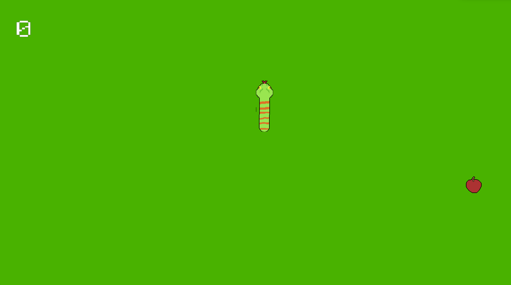

[![MIT License][license-shield]][license-url]

<!-- PROJECT LOGO -->
<br />
<div align="center">

<h3 align="center">SNAKE ECS</h3>

  <p align="center">
    An over engineered game developed using the ECS architecture
    <br />
    </p>
</div>


<!-- TABLE OF CONTENTS -->
<details>
  <summary>Table of Contents</summary>
  <ol>
    <li>
      <a href="#about-the-project">About The Project</a>
      <ul>
        <li><a href="#built-with">Built With</a></li>
      </ul>
    </li>
    <li>
      <a href="#getting-started">Getting Started</a>
      <ul>
        <li><a href="#installation">Installation</a></li>
      </ul>
    </li>
    <li><a href="#license">License</a></li>
    <li><a href="#contact">Contact</a></li>
  </ol>
</details>


## About The Project



SNAKE_ECS was developed as an effort to learn the ECS architecture and the SDL2 library.
In retrospective Snake was not the best choice for the ECS architecture, but it was an
exercise to also make it fit in.

The parallel effort was also to have a better separation from the game and the engine.
This game is an iteration on the development of my own engine built from scratch.

### Future Improvements

While developing this game I found myself struggling to animate the snake and my
limited knowledge on C++ and animations fell short. I have some ideas on how to
improve it, but I'll rethink this when I have more experience.

I also had some issues with the texture rendering using SDL2, there's some visual
bugs that you can notice also in the preview, that I don't know the origin and
I don't have the time to find out why.

### Built With

* SDL2
* ECS (credit to the [developer](https://austinmorlan.com/) where I took the inspiration from)

## Getting Started

To correctly build the project you will need to import to this libraries into the project (or use a package manager):

- SDL2
- SDL2_image
- SDL2_ttf
- SDL2_mixer
- nlohmann_json

And have installed `CMake 3.26` and a C++ 20 compiler.

### Installation

To build do:

```
    cmake .
    mkdir build
    cd build
    cmake --build .
```

To install the game do:

```
    cd build
    cmake --install .
```


## License

Distributed under the MIT License. See `MIT-LICENSE.txt` for more information.

## Contact

Github profile: https://github.com/AlessandroRoic

Portfolio website: https://alessandroroic.github.io/

<p align="right">(<a href="#readme-top">back to top</a>)</p>

<!-- MARKDOWN LINKS & IMAGES -->
<!-- https://www.markdownguide.org/basic-syntax/#reference-style-links -->

[license-shield]: https://img.shields.io/github/license/othneildrew/Best-README-Template.svg?style=for-the-badge

[license-url]: https://github.com/othneildrew/Best-README-Template/blob/master/LICENSE.txt
